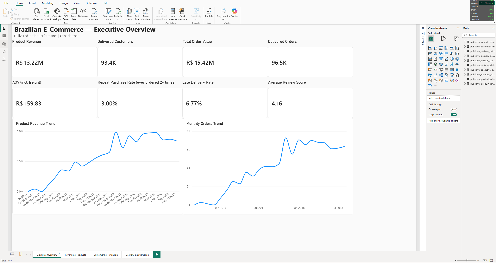
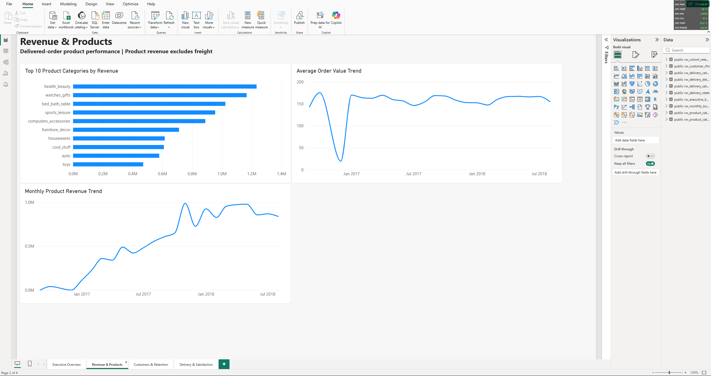
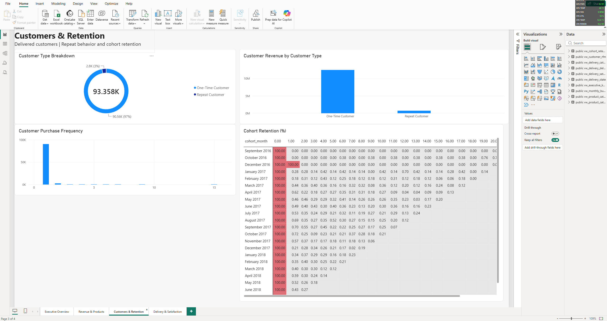
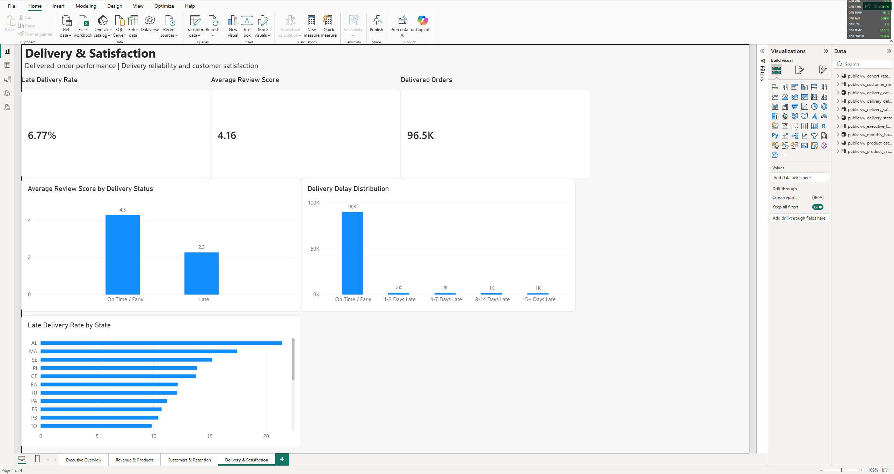

# Olist Brazilian E-Commerce Analytics

**PostgreSQL · SQL · Power BI** — an end-to-end analysis of the public Olist Brazilian E-Commerce dataset, covering revenue, customers, retention, product categories, delivery reliability, and customer satisfaction.

> Independent portfolio project built on the public [Olist Brazilian E-Commerce dataset](https://www.kaggle.com/datasets/olistbr/brazilian-ecommerce) (Kaggle). Not affiliated with or endorsed by Olist.

---
## Dashboard Preview

### Executive Overview



### Revenue & Products



### Customers & Retention



### Delivery & Satisfaction



## Key Findings

All headline figures below use the **delivered-order population** unless stated otherwise.

1. **R$13.22M in product revenue** across **96,478 delivered orders** and **93,358 delivered customers**.
2. **Repeat purchasing is rare:** 2,801 customers (3.00%) ordered more than once; weighted Month-1 retention is **0.48%**.
3. **Late deliveries are strongly associated with lower reviews:** **2.27** average review score for late orders vs **4.29** for on-time/early orders. This is an observed association, not a causal estimate.

---

## Overview

This project analyzes the Brazilian Olist marketplace dataset using PostgreSQL for data preparation and analysis and Power BI for the final dashboard.

The analysis was designed around four business areas:

- **Revenue & Products** — revenue, order value, monthly performance, and category mix
- **Customers & Retention** — repeat purchasing, cohorts, retention, and RFM segmentation
- **Delivery & Satisfaction** — delivery delays, review scores, delay severity, and geographic patterns
- **Executive KPIs** — a reconciled final data layer for Power BI

The final dashboard uses **delivered orders** as its primary analytical population.

---

## Business Questions

The project answers questions such as:

1. How much marketplace product revenue was generated?
2. How many delivered orders and customers were served?
3. What is the average order value?
4. How common are repeat purchases?
5. How does retention change after a customer's first purchase?
6. Which customer groups represent the greatest historical value?
7. Which product categories generate the most revenue?
8. How frequently are deliveries late?
9. How are delivery delays associated with customer review scores?
10. Which states have the highest late-delivery rates?
11. Do the SQL views reconcile across different analytical layers?

---

## Dataset and Credit

**Source:** [Olist Brazilian E-Commerce Public Dataset](https://www.kaggle.com/datasets/olistbr/brazilian-ecommerce), published on Kaggle.

The dataset contains approximately 100K orders from 2016–2018 and includes customers, orders, order items, payments, reviews, products, sellers, product-category translations, and geolocation data.

Raw CSV files are **not committed to this repository**. The `data/` directory is excluded through `.gitignore`. Download the dataset from Kaggle and place the CSV files under:

```text
data/raw/
```

### Dataset license

The Kaggle dataset is listed under the **CC BY-NC-SA 4.0** license. Review the current license terms on the Kaggle dataset page before redistributing the raw data.

This project is an independent portfolio analysis and is **not affiliated with, sponsored by, or endorsed by Olist**.

### Loaded tables

| Table | Rows loaded |
|---|---:|
| customers | 99,441 |
| orders | 99,441 |
| order_items | 112,650 |
| order_payments | 103,886 |
| order_reviews | 99,224 |
| products | 32,951 |
| sellers | 3,095 |
| product_category_name_translation | 71 |
| geolocation | 1,000,163 |

---

## Definitions

| Term | Definition |
|---|---|
| Delivered order | `order_status = 'delivered'` |
| Customer | `customer_unique_id`, which identifies the customer across orders; `customer_id` is order-specific |
| Product revenue | `SUM(order_items.price)` for delivered orders, excluding freight |
| Revenue meaning | Marketplace merchandise sales value; **not Olist's own income or profit** |
| Freight | `SUM(order_items.freight_value)` |
| Total order value | Product revenue + freight |
| AOV | Average order-level total order value, **including freight** |
| Repeat customer | Customer with 2+ delivered orders |
| Late order | Delivered date later than the estimated delivery date, compared at calendar-day level |
| Average review score | Average review score per order first, then averaged across orders |
| Cohort | Month of a customer's first delivered purchase |
| Month-N retention | Share of a cohort that bought again in the Nth calendar month after the first purchase |
| Weighted retention | `SUM(active_customers) / SUM(eligible_cohort_customers)` rather than the simple average of cohort percentages |
| RFM recency | Snapshot date minus the customer's latest delivered purchase date |
| RFM monetary | Customer's total delivered product revenue |

The final RFM snapshot date is **2018-08-29**, the latest delivered purchase date in the analysis.

---

## Executive KPIs

| KPI | Value |
|---|---:|
| Delivered orders | 96,478 |
| Delivered customers | 93,358 |
| Product revenue | R$13,221,498.11 |
| Total order value (incl. freight) | R$15,419,773.75 |
| AOV (incl. freight) | R$159.83 |
| Repeat customers / rate | 2,801 / 3.00% |
| Late-delivery rate | 6.77% |
| Average review score | 4.16 |

---

## Findings in Detail

### Customers and Retention

There were **93,358 delivered customers**. Of these, **90,557 were one-time customers** and **2,801 were repeat customers**.

- One-time customers averaged **R$137.96** in product revenue.
- Repeat customers averaged **R$260.05** across **2.11 delivered orders**, or roughly **R$123 per order**.
- Therefore, repeat customers had greater historical value across their customer lifetime, but the rounded figures do **not** show higher product revenue per order than one-time customers.

### Repeat Rate vs Month-1 Retention

These two metrics answer different questions:

- **Repeat purchase rate: 3.00%** — the share of delivered customers who ever placed at least two delivered orders during the observed dataset.
- **Weighted Month-1 retention: 0.48%** — the share of eligible customers who made another purchase in the **next calendar month** after their first delivered purchase.

The simple average of cohort Month-1 percentages is about 4.96%, but it gives tiny early cohorts the same weight as much larger cohorts. The weighted figure is therefore used as the headline Month-1 retention metric.

---

### RFM Segmentation

Customers are segmented using quintile-based **Recency** and **Monetary** scores. Frequency is kept as a descriptive metric rather than scored because approximately 97% of customers purchased only once.

| Segment | Customers | Share | Repeat customers | Product revenue | Avg. value |
|---|---:|---:|---:|---:|---:|
| Recent High Value | 15,424 | 16.52% | 932 | R$4,174,841 | R$270.67 |
| High Value At Risk | 14,537 | 15.57% | 727 | R$4,050,385 | R$278.63 |
| Middle Value | 18,672 | 20.00% | 603 | R$2,498,222 | R$133.80 |
| Inactive / Low Value | 22,807 | 24.43% | 269 | R$1,276,078 | R$55.95 |
| Recent Low/Medium Value | 21,918 | 23.48% | 270 | R$1,221,973 | R$55.75 |

The two largest-value segments — **Recent High Value** and **High Value At Risk** — contain about **32.1% of customers** and account for approximately **62.2% of product revenue**.

> **Important:** “High Value At Risk” means the customer bought a relatively high amount historically but has a relatively old last purchase. It does **not** mean the customer is statistically proven to be likely to churn or return. The dataset contains no marketing or churn-history information.

---

### Delivery and Satisfaction

| Delivery status | Average review |
|---|---:|
| On time / early | 4.29 |
| 1–3 days late | 3.29 |
| 4–7 days late | 2.11 |
| 8–14 days late | 1.67 |
| 15+ days late | 1.73 |

Review scores fall sharply as delays worsen, especially during the first two weeks, and then flatten slightly beyond about a week.

Overall:

- **6.77%** of orders with calculable delivery delays were late.
- **6,534** orders were late.
- Late orders averaged **2.27** stars.
- On-time/early orders averaged **4.29** stars.

This is an **observational association**. The analysis does not establish that lateness itself caused the review-score difference.

---

### Geographic Delivery Pattern

Among states with at least 100 delivered orders, the highest documented late-delivery rates were:

| State | Delivered orders | Late rate | Avg. review |
|---|---:|---:|---:|
| AL | 397 | 21.41% | 3.85 |
| MA | 717 | 17.43% | 3.83 |
| SE | 335 | 15.22% | 3.91 |
| PI | 476 | 13.87% | 3.99 |
| CE | 1,279 | 13.76% | 3.94 |

These states are useful targets for **investigating** delivery performance, estimated-delivery accuracy, and carrier operations. The dataset does not contain enough operational detail to explain why these states have higher late rates.

Small state-level groups can have substantial statistical uncertainty; for example, the 397 delivered orders in Alagoas produce a much less stable estimate than a state with several thousand orders.

---

### Products and Categories

Top categories by delivered-order product revenue:

| # | Category | Revenue | Share |
|---:|---|---:|---:|
| 1 | health_beauty | R$1,233,132 | 9.33% |
| 2 | watches_gifts | R$1,166,177 | 8.82% |
| 3 | bed_bath_table | R$1,023,435 | 7.74% |
| 4 | sports_leisure | R$954,853 | 7.22% |
| 5 | computers_accessories | R$888,725 | 6.72% |
| 6 | furniture_decor | R$711,928 | 5.38% |
| 7 | housewares | R$615,629 | 4.66% |
| 8 | cool_stuff | R$610,204 | 4.62% |
| 9 | auto | R$578,967 | 4.38% |
| 10 | **Garden Tools** | **R$470,495** | **3.56%** |

The top five categories represent approximately **39.8%** of delivered-order product revenue. The top ten represent approximately **62.4%** based on the documented category results.

No individual category exceeds 10% of product revenue, so the marketplace is not dominated by a single product category.

#### Category completeness

- 32,951 products are present in the product table.
- 32,341 have a category.
- 610 products have no category.
- Uncategorized delivered revenue is **R$170,726.63**, or approximately **1.29%** of product revenue.

Uncategorized products are retained as **`Uncategorized`** rather than dropped so category revenue reconciles to the executive product-revenue total.

---

## Power BI Dashboard

The final Power BI report contains four pages:

### Page 1 — Executive Overview

Provides the main business KPIs and high-level performance view:

- Delivered orders
- Delivered customers
- Product revenue
- Total order value
- AOV
- Repeat purchase rate
- Late-delivery rate
- Average review score
- Monthly performance

### Page 2 — Revenue & Products

Focuses on:

- Revenue trends
- Product/category performance
- Category revenue contribution
- Top categories
- Product and order-level revenue metrics

### Page 3 — Customers & Retention

Focuses on:

- One-time vs repeat customers
- Customer value
- RFM segmentation
- Cohort retention
- Month-1 retention

### Page 4 — Delivery & Satisfaction

Focuses on:

- Late-delivery rate
- Delivery delay buckets
- Review-score differences
- State-level delivery performance
- Category-level delivery performance

---

## SQL Analysis Pipeline

| File | Purpose |
|---|---|
| `00_create_tables.sql` | Creates the nine raw PostgreSQL tables and their supported keys/relationships |
| `01_load_checks.sql` | Verifies that the nine raw tables were loaded |
| `02_data_quality.sql` | Checks uniqueness, statuses, dates, payments, reviews, prices, and other data issues |
| `03_cleaned_views.sql` | Builds cleaned order-, payment-, revenue-, and review-level views |
| `04_revenue_growth.sql` | Exploratory revenue, monthly growth, and category analysis |
| `05_rfm_segmentation.sql` | Customer RFM metrics, customer types, and RFM segments |
| `06_cohort_retention.sql` | Cohort construction and retention grid |
| `07_delivery_satisfaction.sql` | Delivery delays, review association, state, and category analysis |
| `08_product_category.sql` | Delivered-order product-category performance and revenue reconciliation |
| `09_executive_dashboard.sql` | Final executive, monthly, RFM, and cohort views used by Power BI |

---

## Data Quality and Validation

Several reconciliation checks were used to ensure that the analytical views agree.

### Core reconciliation

- Executive vs monthly orders: **96,478**
- Executive vs monthly product revenue: **R$13,221,498.11**
- Executive vs monthly total order value: **R$15,419,773.75**
- Executive vs RFM customers: **93,358**
- Executive vs RFM repeat customers: **2,801**
- RFM segment customers: **93,358**
- RFM segment product revenue: **R$13,221,498.11**
- Category revenue + Uncategorized: **R$13,221,498.11**

### Important data-quality decisions

- `customer_unique_id` is used for customer-level analysis.
- Payment rows are aggregated before joining to orders.
- Order items are aggregated before calculating order-level metrics.
- Multiple reviews are averaged at the order level before calculating the overall average review score.
- Eight delivered orders without calculable delivery dates are excluded from late-rate denominators.
- Category analysis preserves uncategorized products.
- State/category delivery analysis requires at least 100 delivered orders/order-category rows.
- Category order counts are **not additive** because one order can contain products from multiple categories.

See [`docs/cleaning_log.md`](docs/cleaning_log.md) for the full validation record and [`docs/data_dictionary.md`](docs/data_dictionary.md) for analytical definitions and view grains.

---

## Limitations

### Dataset coverage

- The dataset covers **2016–2018** and ends on **2018-08-29**.
- Early 2016 contains very few orders, so early monthly growth rates and early cohorts should not be interpreted as stable business trends.
- The final period is partial, so the last cohort months are incomplete.

### Delivery analysis

- Eight delivered orders do not have enough delivery-date information to calculate a delivery delay and are excluded from late-rate denominators.
- State/category delivery analysis is filtered to groups with at least 100 observations, but small groups can still have considerable uncertainty.
- The relationship between delivery lateness and review scores is observational, not causal.

### Product/category analysis

- 610 products have no category, representing approximately 1.29% of delivered product revenue.
- Category delivery counts are at **order-category grain**. A single order containing multiple categories can appear in multiple categories, so category counts cannot be summed to recover total orders.
- Two of the 73 category names do not have English translations and therefore retain their original names.

### Customer analysis

- Month-N retention uses **calendar months**, not rolling 30-day windows.
- RFM segments use relative quintiles, so "high value" is relative to this dataset.
- Tied RFM values can be split across quintile boundaries.
- The dataset contains no marketing-history, campaign, churn-reason, or customer-acquisition data.

### Financial interpretation

- Product revenue is merchandise sales value and excludes freight.
- Total order value includes freight.
- There is no cost, margin, commission, advertising, seller payout, or profit data, so the project cannot measure profitability.

### Analytical populations

There are two intentionally different revenue populations in the SQL repository:

- `04_revenue_growth.sql` is an **exploratory historical analysis** that excludes only canceled and unavailable orders.
- `08_product_category.sql` and `09_executive_dashboard.sql` use **delivered orders only** for the final dashboard.

These totals should not be expected to match. The difference is intentional and documented.

---

## Reproducibility

### Requirements

- PostgreSQL
- pgAdmin or another PostgreSQL client
- Power BI Desktop
- Olist CSV dataset from Kaggle

### Setup

1. Create a PostgreSQL database named:

```text
olist_analysis
```

2. Download the Olist CSV dataset from Kaggle and place the files in:

```text
data/raw/
```

3. Run:

```text
00_create_tables.sql
```

This creates the raw database tables and supported relationships.

4. Load the nine CSV files into their corresponding tables.

5. Run the SQL pipeline in order:

```text
01_load_checks.sql
02_data_quality.sql
03_cleaned_views.sql
04_revenue_growth.sql
05_rfm_segmentation.sql
06_cohort_retention.sql
07_delivery_satisfaction.sql
08_product_category.sql
09_executive_dashboard.sql
```

6. Open:

```text
dashboard/Olist_Ecommerce_Analytics.pbix
```

7. Point the Power BI PostgreSQL connection to your local `olist_analysis` database and refresh the report.

### Fresh database recommendation

Run the complete SQL pipeline on a **fresh database** when reproducing the project.

`03_cleaned_views.sql` and `06_cohort_retention.sql` contain view replacement/drop logic with dependencies. Re-running them against an already populated database can fail when dependent views still exist.

---

## SQL Techniques Used

The project demonstrates practical PostgreSQL techniques including:

- **CTEs** for multi-stage analytical transformations
- **Window functions**
  - `LAG`
  - `NTILE`
  - `SUM() OVER`
- **`FILTER` aggregates**
- **`PERCENTILE_CONT`** for distribution analysis
- **`generate_series`** for building cohort month grids
- **`LATERAL`** for cohort-related transformations
- **Distinct order-category handling** to prevent item-level multiplication
- **View layering** for reusable analytical data models
- **Reconciliation queries** to validate independent analytical views
- Aggregation from one-to-many tables before joining to order-level data

---

## Project Structure

```text
olist-analysis/
├── README.md
├── .gitignore
│
├── sql/
│   ├── 00_create_tables.sql
│   ├── 01_load_checks.sql
│   ├── 02_data_quality.sql
│   ├── 03_cleaned_views.sql
│   ├── 04_revenue_growth.sql
│   ├── 05_rfm_segmentation.sql
│   ├── 06_cohort_retention.sql
│   ├── 07_delivery_satisfaction.sql
│   ├── 08_product_category.sql
│   └── 09_executive_dashboard.sql
│
├── dashboard/
│   ├── Olist_Ecommerce_Analytics.pbix
│   └── screenshots/
│       ├── 01_executive_overview.png
│       ├── 02_revenue_products.png
│       ├── 03_customers_retention.png
│       └── 04_delivery_satisfaction.png
│
├── docs/
│   ├── cleaning_log.md
│   ├── data_dictionary.md
│   └── memo.md
│
└── data/
    └── raw/              # local only; not committed
```

---

## Business Memo

The project includes a short business memo translating the analytical results into practical actions:

[`docs/memo.md`](docs/memo.md)

The recommendations focus on:

- Testing customer reactivation rather than assuming churn can be predicted
- Investigating delivery performance in high-late-rate states
- Improving category completeness
- Avoiding unsupported causal or revenue claims

---

## Author

**Tahmid Jawad Shafi**  
BSc in Computer Science & Engineering  
American International University-Bangladesh
